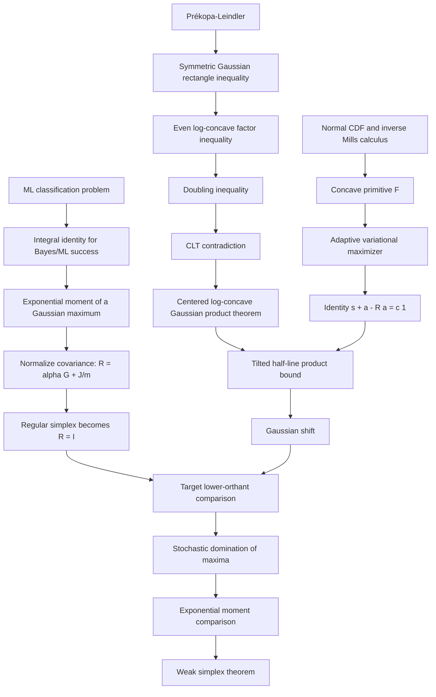

# Lean Formalization Feasibility and Execution Plan  
## Claimed proof of the weak simplex conjecture

**Status:** Formalization architecture and execution dossier  
**Date:** 2026-07-12  
**Intended audience:** Lean 4/mathlib contributors, probability formalizers, convex-analysis formalizers, integration leads, and independent mathematical reviewers  
**Primary source:** `simplex_optimality_proof.md`  
**Supporting source:** `Assessment of the Attached Weak Simplex Conjecture Proof.pdf`

---

## 0. Document purpose and scope

This report converts the attached mathematical proof into a concrete formalization program. It is written so that multiple agents can work in parallel without first reconstructing the proof architecture, deciding all interfaces from scratch, or repeatedly rediscovering the same library gaps.

The proposed end product is a Lean 4 development that:

1. states the weak simplex theorem in an operational maximum-likelihood classification form;
2. proves the Gaussian orthant comparison that forms the mathematical core;
3. proves the centered log-concave product inequality used by the orthant argument;
4. discharges all analytic, probabilistic, and finite-dimensional convexity dependencies;
5. compiles against a pinned Lean/mathlib version;
6. contains no `sorry`, `admit`, project-specific `axiom`, or opaque imported theorem whose own axiom footprint has not been audited; and
7. passes a final `#print axioms` audit on the exported main theorem.

This is an **execution plan**, not a claim that a Lean prototype has already been compiled. The mathematical proof has been audited at the level described below, but a kernel check remains the purpose of the project.

---

## 1. Executive decision

### 1.1 Feasibility verdict

A complete Lean certification is feasible.

The proof is a relatively good formalization candidate because it is:

- finite-dimensional;
- organized as an explicit theorem dependency chain;
- based on classical probability and convex analysis rather than highly geometric intuition;
- algebraically explicit in its most distinctive step;
- compatible with existing mathlib infrastructure for finite-dimensional Gaussians, weak convergence, central limit theorems, Gram matrices, and measure-theoretic integration; and
- divisible into modules with reasonably clean interfaces.

The main obstacle is not the weak simplex geometry itself. The principal cost lies in the analytic chain

\[
\text{Prékopa--Leindler}
\Longrightarrow
\text{symmetric Gaussian rectangles}
\Longrightarrow
\text{even log-concave factors}
\Longrightarrow
\text{doubling}
\Longrightarrow
\text{centered product inequality}.
\]

A second, independent analytic block is the inverse-Mills calculus and the existence/stationarity argument for the adaptive variational problem.

### 1.2 Mathematical confidence by component

| Component | Current confidence | Main concern |
|---|---:|---|
| ML decoding integral identity | High | Measurable tie-breaking is tedious, not conceptually doubtful |
| Normalization \(R=\alpha G+J/m\) | High | Matrix/coercion engineering |
| Regular simplex maps to \(I\) | High | Canonical simplex representation |
| Symmetric Gaussian rectangle lemma | High | Prékopa/log-concavity infrastructure |
| Even-factor layer-cake corollary | High | Endpoint conventions and ENNReal bookkeeping |
| Centered product theorem | Medium-high | Largest proof-engineering burden; density and CLT interfaces |
| Inverse Mills identities | High | Improper-integral and derivative APIs |
| Variational maximizer | High | Need an explicit compact-superlevel proof |
| Stationarity and \(s+a-Ra=c\mathbf 1\) | High | Fréchet derivative implementation |
| Tilted half-lines and Gaussian shift | High | Need a reusable finite-dimensional shift theorem |
| Singular covariance passage | High after redesign | Should be moved to the final orthant theorem |
| Stochastic domination to exponential moments | High | Layer-cake conversion |
| Final weak simplex packaging | High | Avoid starting with measurable `argmax` |

No obvious fatal sign error or algebraic contradiction was found. The two components that deserve independent mathematical review before a large implementation commitment are:

1. the centered product theorem and its doubling/CLT proof; and
2. the compactness and differentiability details in the adaptive tilt.

The supporting novelty assessment reaches the same practical conclusion: Section 6 is the proof’s main engine and the first place to scrutinize, while Section 8 is the most distinctive step and the second place to verify carefully.

### 1.3 Recommended certification target

The recommended primary theorem is **not initially the operational decoder statement**. It is the Gaussian orthant comparison:

> For \(m\ge 2\), unit vectors \(x_1,\dots,x_m\),  
> \[
> R=\frac{m-1}{m}G+\frac1mJ,
> \]
> and \(X\sim N(0,R)\), one has
> \[
> \mathbb P(X_i\le c\ \forall i)\ge \Phi(c)^m
> \qquad\text{for every }c\in\mathbb R.
> \]

This theorem contains the novel mathematical content. Once it is certified, the passage to stochastic domination, exponential moments, and maximum-likelihood success is comparatively routine.

### 1.4 Expected effort

A reasonable planning range is:

- **conditional adaptive-tilt core, assuming the centered product theorem:** 4–8 expert weeks;
- **full analytic core, Sections 5–9:** 3–7 person-months if reusable Prékopa/Anderson code ports successfully;
- **full project from mathlib alone:** approximately 4–9 person-months;
- **likely code volume:** 12,000–30,000 lines of Lean, depending on how much infrastructure is upstreamed or reused.

A fleet of 6–10 agents can shorten calendar time, but the critical path is long and integration-heavy. A realistic coordinated calendar target is roughly 8–18 weeks, with substantial uncertainty.

---

## 2. Source proof and proof architecture

### 2.1 Main statement

Let \(m=n+1\), let \(x_1,\dots,x_m\) be unit vectors, and let

\[
Y=\lambda x_I+Z,
\qquad
Z\sim N(0,I),
\]

where the label \(I\) is uniform. The decoder selects a score maximizer. The manuscript claims that the average correct-decoding probability is maximized by a regular simplex for every \(\lambda>0\).

### 2.2 Proof pipeline

The manuscript’s proof is organized as follows.



### 2.3 Dependency summary

| Manuscript section | Mathematical output | Depends on |
|---|---|---|
| §3 | ML success \(=\frac{e^{-\lambda^2/2}}m \mathbb E e^{\lambda M_G}\) | Gaussian density and finite max |
| §4 | normalized covariance \(R\), simplex \(R=I\) | Gram matrix algebra |
| §5 | symmetric rectangles and even factors | Gaussian regression, Prékopa, layer cake |
| §6 | centered product theorem | §5, doubling, CLT, positive density |
| §7 | \(r,H,\mathcal F\) calculus | normal CDF, integration by parts, Mills bounds |
| §8 | adaptive optimizer and threshold identity | §7, compactness, finite-dimensional calculus |
| §9 | orthant comparison | §6, §8, Gaussian shift |
| §10 | weak simplex theorem | §3, §4, §9, stochastic-order integration |

---

## 3. Certification milestones

The project should use explicit milestones so that “core proof,” “conditional proof,” and “complete certification” are never conflated.

### M0 — Compiling semantic skeleton

Deliverables:

- all central definitions;
- all final theorem statements;
- module graph;
- temporary hypotheses used only in a clearly named `Scaffold` namespace;
- no claim of certification.

Purpose:

- stabilize types and interfaces;
- reveal coercion and library issues early;
- let agents work against fixed signatures.

### M1 — Adaptive tilt under a product theorem hypothesis

Certified components:

- normal CDF and inverse Mills lemmas;
- construction and properties of \(H\) and \(\mathcal F\);
- maximizer existence;
- stationarity;
- \(s+a-Ra=c\mathbf1\);
- tilted half-line mass and barycenter calculations;
- Gaussian shift;
- orthant bound assuming the centered product theorem.

This milestone verifies the most distinctive part of the argument, but it does **not** leave only easy work. The centered product theorem remains the hardest dependency.

### M2 — Certified orthant theorem

Certified components:

- Sections 5–9;
- no product-theorem assumption;
- positive-definite case;
- singular case by outer approximation;
- final lower-orthant comparison.

This is the first milestone that certifies the genuine mathematical core.

### M3 — Full weak simplex theorem

Additional certified components:

- ML/Bayes success identity;
- normalization and regular-simplex value;
- stochastic domination to exponential moments;
- operational theorem in the original \(m=n+1\) formulation.

### M4 — Publication-quality development

Additional requirements:

- polished API and documentation;
- all imported external code audited and attributed;
- theorem names and module boundaries suitable for upstreaming;
- CI reproducibility;
- independent review;
- `#print axioms` dossier.

---

## 4. Recommended theorem boundaries

### 4.1 Matrix/orthant theorem

A schematic target is:

```lean
theorem normalizedCov_lowerOrthant
    {m : ℕ} (hm : 2 ≤ m)
    {E : Type*}
    [NormedAddCommGroup E]
    [InnerProductSpace ℝ E]
    [FiniteDimensional ℝ E]
    (x : Fin m → E)
    (hx : ∀ i, ‖x i‖ = 1)
    (c : ℝ) :
    let R := normalizedCov x
    Measure.real (multivariateGaussian 0 R) (lowerOrthant c)
      ≥ (stdNormalCDF c) ^ m
```

The exact measure coercions and covariance representation will depend on the chosen mathlib snapshot. This signature is schematic, not guaranteed to elaborate verbatim.

### 4.2 Positive-definite core

The analytic core should first prove:

```lean
theorem normalizedCov_lowerOrthant_of_posDef
    ...
    (hR : Matrix.PosDef (normalizedCov x)) :
    ...
```

The singular case should be a separate theorem.

### 4.3 Centered product theorem

```lean
theorem centered_logConcave_product_of_posDef
    {k : ℕ}
    (R : CorrelationMatrix (Fin k))
    (hR : Matrix.PosDef R.val)
    (f : Fin k → ℝ → ℝ)
    (hf_nonneg : ∀ i x, 0 ≤ f i x)
    (hf_bounded : ∀ i, Bornology.IsBounded (Set.range (f i)))
    (hf_logConcave : ∀ i, LogConcave (f i))
    (hf_mass_pos : ∀ i, 0 < ∫ x, f i x ∂stdGaussianReal)
    (hf_centered : ∀ i, ∫ x, x * f i x ∂stdGaussianReal = 0) :
    ∫ z, ∏ i, f i (z i) ∂multivariateGaussian 0 R.val
      ≥ ∏ i, ∫ x, f i x ∂stdGaussianReal
```

The actual project may prefer ENNReal-valued functions for the product theorem and provide a real-valued wrapper.

### 4.4 Operational theorem

```lean
theorem weak_simplex
    {n : ℕ} (hn : 1 ≤ n)
    (λ : ℝ) (hλ : 0 < λ)
    (x : Fin (n + 1) → EuclideanSpace ℝ (Fin n))
    (hx : ∀ i, ‖x i‖ = 1) :
    mlSuccess λ x ≤ regularSimplexSuccess (n + 1) λ
```

A separate theorem should identify `regularSimplexSuccess` with any codebook satisfying the regular-simplex Gram relations.

---

## 5. Major architectural recommendations

### 5.1 Move all singular-covariance work to the final orthant theorem

The manuscript extends the centered product theorem itself from positive-definite to singular correlation matrices. That extension requires an almost-everywhere continuity theorem for bounded log-concave functions and a dominated-convergence argument at every factor.

This is avoidable.

Let

\[
R=\alpha G+\frac1mJ,\qquad
\alpha=\frac{m-1}{m}.
\]

For \(0<\varepsilon<1\), define

\[
R_\varepsilon=(1-\varepsilon)R+\varepsilon I.
\]

Then \(R_\varepsilon\) is positive definite. Moreover,

\[
I=\alpha G_\Delta+\frac1mJ,
\]

where \(G_\Delta\) is the regular-simplex Gram matrix, so

\[
R_\varepsilon
=
\alpha\bigl((1-\varepsilon)G+\varepsilon G_\Delta\bigr)
+\frac1mJ.
\]

The convex combination

\[
G_\varepsilon=(1-\varepsilon)G+\varepsilon G_\Delta
\]

is again a Gram matrix of unit vectors. Constructively, if \(v_i\) are regular-simplex vertices, use

\[
x_i^{(\varepsilon)}
=
\sqrt{1-\varepsilon}\,x_i
\oplus
\sqrt{\varepsilon}\,v_i.
\]

Therefore the positive-definite orthant theorem applies to \(R_\varepsilon\). Then:

- \(N(0,R_\varepsilon)\Rightarrow N(0,R)\);
- the lower orthant is a continuity set because each coordinate is a standard normal and its boundary lies in a finite union of coordinate hyperplanes;
- Portmanteau yields the desired limit.

**Recommendation:** prove Sections 5–9 only for positive-definite \(R\), and handle singular \(R\) once, at the outermost theorem.

Benefits:

- removes the need for a general theorem on discontinuities of log-concave functions;
- avoids factorwise dominated convergence;
- keeps the product theorem cleaner;
- isolates weak convergence in one module;
- makes the Cameron–Martin and density arguments easier.

### 5.2 Do not begin with measurable `argmax`

Define the Bayes/ML success functional first as

\[
\frac1m\int \max_i p_i(y)\,dy.
\]

Prove the exponential-moment identity for this functional. Only later prove that any measurable maximum-likelihood selector has this average success.

Benefits:

- avoids early finite-choice measurability work;
- separates decision-theoretic packaging from the analytic theorem;
- prevents tie-breaking from blocking the project.

### 5.3 Separate vector geometry from covariance algebra

Maintain three layers:

1. **Codebook layer:** vectors \(x_i\), Gram matrix \(G\).
2. **Covariance layer:** \(R=\alpha G+J/m\), Gaussian measure \(N(0,R)\).
3. **Probability layer:** orthants and maxima.

Most of Sections 5–7 should know nothing about codebooks. Section 8 needs a Gram realization. The final theorem should pass through explicit interface lemmas rather than repeatedly unfolding all definitions.

### 5.4 Prove only the Prékopa specialization actually needed

A completely general log-concave-measure library is not required. The project needs:

1. log-concavity of
   \[
   t\mapsto\int \mathbf 1_A(y+tb)\rho(y)\,dy
   \]
   for a convex set \(A\) and Gaussian density \(\rho\);
2. log-concavity of the doubling transform;
3. closure of products and affine precomposition.

A general finite-dimensional Prékopa–Leindler theorem is useful if it can be reused from an external project. If not, a targeted one-dimensional marginal theorem may be substantially cheaper.

### 5.5 Use explicit compact superlevel sets in Section 8

Do not formalize “coercive, therefore a maximizer exists” as a black box unless an appropriate theorem already exists.

Let

\[
p_0=(H(c),0),\qquad
L=\mathcal J_c(p_0)=m\log\Phi(c)<0.
\]

For any point with \(\mathcal J_c\ge L\):

- because \(\mathcal F\le0\), the negative quadratic terms bound \(\|(q,v)\|\);
- if some \(\mathcal F(y_i)<L\), then all other \(\mathcal F\)-terms and both negative quadratic terms are nonpositive, forcing \(\mathcal J_c<L\);
- hence every \(\mathcal F(y_i)\ge L\);
- since \(\mathcal F(y)\to-\infty\) as \(y\downarrow0\), there is a uniform \(\delta>0\) with \(y_i\ge\delta\).

Thus the relevant superlevel set lies in an explicit compact set

\[
\{(q,v):\|(q,v)\|\le M,\ y_i\ge\delta\ \forall i\}
\]

contained in the open domain.

This is a robust Lean proof and avoids vague coercivity automation.

### 5.6 Uniqueness of the maximizer is optional

The proof only needs a maximizer in the interior and its stationarity equations. Strict concavity and uniqueness are mathematically true, but uniqueness is not on the critical path.

Prove uniqueness only after the orthant theorem compiles, unless it is essentially free from the chosen convexity API.

### 5.7 Prefer exact named temporary hypotheses over `axiom` or `sorry`

During parallel development, downstream modules may assume an upstream result through a parameter:

```lean
variable
  (centeredProduct :
    ∀ ..., CenteredProductStatement ...)
```

or through a structure collecting dependencies.

Do not introduce a project-level `axiom centeredProduct`. The final dependency audit is much safer when assumptions are explicit parameters and scaffold modules are not imported by production `Main.lean`.

---

## 6. Mathlib and external-code inventory

### 6.1 Snapshot information

A current mathlib master snapshot inspected for this report was:

- mathlib commit: `f34e762642b3470574f0117a100a8fc4eaeae651`;
- Lean toolchain at that commit: `leanprover/lean4:v4.32.0-rc1`.

This is an inventory point, not automatically the recommended baseline. Starting on an RC toolchain can increase churn. The project should compare:

- a recent stable mathlib release;
- the exact version used by candidate external Prékopa infrastructure; and
- current master if essential Gaussian features are missing from the stable release.

### 6.2 Relevant official mathlib modules

The following modules are directly relevant.

| Topic | Module |
|---|---|
| Multivariate Gaussian measures | `Mathlib/Probability/Distributions/Gaussian/Multivariate.lean` |
| Real Gaussian distribution and density | `Mathlib/Probability/Distributions/Gaussian/Real.lean` |
| Gaussian independence from zero covariance | `Mathlib/Probability/Distributions/Gaussian/HasGaussianLaw/Independence.lean` |
| One-dimensional CLT | `Mathlib/Probability/CentralLimitTheorem.lean` |
| Portmanteau and continuity-set convergence | `Mathlib/MeasureTheory/Measure/Portmanteau.lean` |
| CDF framework | `Mathlib/Probability/CDF.lean` |
| Gram matrices | `Mathlib/Analysis/InnerProductSpace/GramMatrix.lean` |
| Improper integrals | `Mathlib/MeasureTheory/Integral/IntegralEqImproper.lean` |
| Interval integration by parts | `Mathlib/MeasureTheory/Integral/IntervalIntegral/IntegrationByParts.lean` |
| Dominated convergence | `Mathlib/MeasureTheory/Integral/DominatedConvergence.lean` |

Useful current facilities include:

- standard and multivariate Gaussian measures;
- covariance and coordinate-marginal facts;
- product standard Gaussian identification;
- Gaussian-law independence under zero covariance;
- one-dimensional CLT;
- weak convergence on continuity sets;
- Gram matrix positive semidefiniteness;
- Gaussian exponential integrability and moment-generating formulas;
- generic CDF monotonicity and endpoint limits.

### 6.3 Gaps not found in current mathlib inventory

A repository search did not reveal a packaged API with obvious names for:

- general log-concave functions;
- Prékopa’s theorem;
- Prékopa–Leindler;
- Šidák’s rectangle inequality;
- the centered product theorem;
- inverse Mills ratio calculus;
- the exact multivariate Gaussian density relative to product standard Gaussian measure;
- the finite-dimensional Cameron–Martin identity in the form needed here;
- first-order stochastic domination as a high-level reusable relation.

This is an inventory result, not proof that no equivalent theorem exists under another name. WP01 must perform a declaration-level search using `#check`, `grep`, documentation search, and LeanSearch/Loogle.

### 6.4 External candidate: StatLean

Repository:

- `https://github.com/StatLean/Stat-Lean`
- inspected commit: `47c6beddbe02b90b4ff1a589827008b451e1c63b`
- toolchain: Lean `v4.29.1`
- mathlib revision: `5e932f97dd25535344f80f9dd8da3aab83df0fe6`
- license: Apache 2.0

Relevant files:

- `StatLean/AsymptoticStatistics/ForMathlib/PrekopaLeindler.lean`
- `StatLean/AsymptoticStatistics/ForMathlib/Anderson.lean`
- `StatLean/AsymptoticStatistics/ForMathlib/MultivariateGaussianWeakLimit.lean`
- `StatLean/AsymptoticStatistics/ForMathlib/MultivariateCLT.lean`
- `StatLean/AsymptoticStatistics/ForMathlib/PiWithDensity.lean`
- related multivariate Gaussian convolution and density files.

The repository contains an n-dimensional Prékopa–Leindler development and an Anderson lemma development. Its Anderson file also contains a useful layer-cake theorem converting superlevel-set domination into an integral inequality.

**Important caution:** comments in the Prékopa file appear partly stale and mention an earlier “keystone gap.” Repository search did not show `sorry` in the key files, but this is not enough. The project must:

1. build the exact commit;
2. run `#print axioms` on `prekopaLeindler` and the desired Anderson theorem;
3. inspect transitive imports;
4. decide whether to depend on the repository, vendor selected files, or upstream the needed pieces.

### 6.5 External candidate: `hojonathanho/isoperimetric`

Repository:

- `https://github.com/hojonathanho/isoperimetric`
- inspected commit: `29768f8beeaf17295cdf3853d37da35d7e2b0a5f`
- toolchain: Lean `v4.26.0-rc2`
- mathlib revision: `36362964cd6b6d5091319813dca81261efefac69`
- license: Apache 2.0

Relevant file:

- `Isoperimetric/PrekopaLeindler.lean`

The file contains a one-dimensional Brunn–Minkowski argument, layer-cake lemmas, and a one-dimensional Prékopa–Leindler theorem.

This is a useful fallback or comparison implementation if the StatLean development is difficult to port.

### 6.6 External-code adoption gate

No external theorem should enter the trusted core until the following checklist is complete.

- [ ] Exact commit builds from a clean checkout.
- [ ] Relevant top-level theorem has no `sorryAx`.
- [ ] No imported custom axioms.
- [ ] License permits reuse and attribution requirements are documented.
- [ ] Port to chosen project toolchain succeeds.
- [ ] The theorem statement matches the needed measurability and codomain conventions.
- [ ] Performance is acceptable in downstream files.
- [ ] A local wrapper isolates upstream API churn.
- [ ] A provenance file records source commit and modifications.

---

## 7. Lean representation strategy

### 7.1 Index types

Use `Fin m` for all finite coordinate families.

Advantages:

- direct compatibility with matrices;
- finite products and sums;
- Euclidean spaces;
- covariance matrices;
- canonical basis and all-ones vectors.

Avoid switching among `Finset`, `Vector`, arrays, and arbitrary finite types unless a theorem genuinely benefits from generality.

### 7.2 Ambient spaces

Recommended split:

- analytic Gaussian product theorem: `EuclideanSpace ℝ (Fin k)` or coordinate functions `Fin k → ℝ`;
- codebook theorem: initially `EuclideanSpace ℝ (Fin n)`;
- optional generalization later to arbitrary finite-dimensional real inner-product spaces.

Generalizing too early introduces basis-selection and measurable-equivalence work without helping the critical proof.

### 7.3 Correlation matrices

If mathlib does not already provide a suitable bundled type, define:

```lean
structure CorrelationMatrix (ι : Type*) [Fintype ι] [DecidableEq ι] where
  val : Matrix ι ι ℝ
  isHermitian : val.IsHermitian
  posSemidef : Matrix.PosSemidef val
  diag_one : ∀ i, val i i = 1
```

Provide coercions sparingly. Excessive coercion from the bundle to a raw matrix often causes elaboration instability.

Essential lemmas:

- coordinate variances equal one;
- convex combination with identity remains a correlation matrix;
- positive definiteness of \((1-\varepsilon)R+\varepsilon I\);
- Gaussian coordinate marginals are standard normals;
- principal submatrices are correlation matrices.

### 7.4 Codebooks and Gram matrices

```lean
structure UnitCodebook (m : ℕ) (E : Type*) [NormedAddCommGroup E]
    [InnerProductSpace ℝ E] where
  point : Fin m → E
  norm_eq_one : ∀ i, ‖point i‖ = 1
```

Definitions:

```lean
def gram (x : UnitCodebook m E) : Matrix (Fin m) (Fin m) ℝ := ...
def alpha (m : ℕ) : ℝ := ((m : ℝ) - 1) / m
def normalizedCov (x : UnitCodebook m E) :=
  alpha m • gram x + (1 / (m : ℝ)) • allOnesMatrix
```

Use `((m : ℝ) - 1)` rather than casting `m - 1` wherever possible; the former avoids natural-subtraction side conditions.

### 7.5 Lower orthants and maxima

```lean
def lowerOrthant {m : ℕ} (c : ℝ) :
    Set (EuclideanSpace ℝ (Fin m)) :=
  {z | ∀ i, z i ≤ c}

def coordMax {m : ℕ} (z : Fin m → ℝ) : ℝ :=
  Finset.univ.sup' ... z
```

It may be easier to define `coordMax` using `Finset.max'` on the image. Prove once:

\[
z\in\operatorname{lowerOrthant}(c)
\iff
\operatorname{coordMax}(z)\le c.
\]

### 7.6 Standard normal CDF

Define a project-local wrapper with a stable API:

```lean
def normalPDF (x : ℝ) : ℝ := ...
def normalCDF (x : ℝ) : ℝ := ...
```

Then prove bridge lemmas to mathlib’s `gaussianReal` and generic `cdf`.

Required API:

- `normalPDF_pos`;
- `normalCDF_pos`;
- `normalCDF_lt_one`;
- `normalCDF_monotone`;
- `normalCDF_continuous`;
- `hasDerivAt_normalCDF`;
- `normalCDF_neg_infty`;
- `normalCDF_pos_infty`;
- measure identity for `Set.Iic`;
- no atoms at a threshold.

Do not scatter raw `ProbabilityTheory.cdf` expressions through the project.

### 7.7 Log-concavity representation

Two practical options exist.

#### Option A: nonnegative real-valued predicate

```lean
def LogConcave (f : E → ℝ) : Prop :=
  (∀ x, 0 ≤ f x) ∧
  ∀ x y θ, θ ∈ Set.Icc (0 : ℝ) 1 →
    f ((1 - θ) • x + θ • y)
      ≥ (f x) ^ (1 - θ) * (f y) ^ θ
```

Problems:

- `Real.rpow` at zero requires case management;
- measurability is not automatic;
- extended-valued log formulations are awkward.

#### Option B: ENNReal-valued functions

This aligns better with Prékopa–Leindler and `lintegral`, but calculus and boundedness statements require wrappers.

**Recommendation:** implement Prékopa and layer-cake internally with ENNReal, and expose a real-valued nonnegative wrapper for Sections 6 and 9.

### 7.8 Real integrals versus `lintegral`

Recommended convention:

- nonnegative product inequalities: prove first in `ℝ≥0∞`;
- barycenters, derivatives, and Gaussian moments: use Bochner/real integrals;
- provide explicit conversion lemmas when functions are nonnegative and integrable.

This prevents repeated `ENNReal.toReal` battles in calculus modules and avoids proving finiteness too early in measure-inequality modules.

---

## 8. Detailed audit by manuscript section

## 8.1 Section 2: log-concavity and preliminaries

### Required results

- products preserve log-concavity;
- affine precomposition preserves log-concavity;
- Gaussian density is log-concave;
- indicators of convex sets are log-concave;
- Prékopa marginalization;
- monotone covariance identity.

### Formalization notes

The monotone covariance identity is elementary and should be proved locally for integrable real random variables:

\[
2\operatorname{Cov}(a(U),b(U))
=
\mathbb E[(a(U)-a(U'))(b(U)-b(U'))].
\]

For Section 5, a still more specialized lemma is enough:

> If \(A\) and \(B\) are both antitone functions of the same real random variable and are integrable, then  
> \(\mathbb E[AB]\ge\mathbb E[A]\mathbb E[B]\).

Avoid formalizing covariance as a separate object unless it simplifies reuse.

### Acceptance criteria

- a compiled `LogConcave.Basic` module;
- a compiled Prékopa theorem or audited imported theorem;
- no downstream dependence on the internal representation of log-concavity.

---

## 8.2 Section 3: ML decoding to a Gaussian maximum

### Mathematical identity

\[
\psi_\lambda(x_1,\dots,x_m)
=
\frac{e^{-\lambda^2/2}}m
\mathbb E e^{\lambda\max_i\langle Z,x_i\rangle}.
\]

### Recommended Lean route

1. Define class-conditional density
   \[
   p_i(y)=\phi_n(y-\lambda x_i).
   \]
2. Define Bayes success as
   \[
   \frac1m\int \max_i p_i(y)\,dy.
   \]
3. prove
   \[
   p_i(y)=\phi_n(y)e^{\lambda\langle y,x_i\rangle-\lambda^2/2};
   \]
4. pull out the common factor and identify the Gaussian expectation;
5. prove exponential integrability using
   \[
   e^{\lambda\max_i \xi_i}\le \sum_i e^{\lambda\xi_i}.
   \]

### Deferred operational layer

Later define a measurable ML selector for a finite family by choosing the least maximizing index. Prove:

- measurability of each comparison set;
- selector measurability;
- partition property;
- selector always chooses a maximum;
- average success equals Bayes success;
- alternative tie-breaking rules have the same average success if they choose a maximizer.

### Risks

- multivariate standard Gaussian density normalization;
- translating between Lebesgue integration and `stdGaussian`;
- finite maximum measurability.

These are routine compared with Sections 6–8.

---

## 8.3 Section 4: normalization and simplex independence

### Required identities

\[
R=\alpha G+\frac1mJ,\qquad
\alpha=\frac{m-1}{m}.
\]

If \(B\sim N(0,1/(m-1))\) is independent of \(\xi\sim N(0,G)\), then

\[
X_i=\sqrt\alpha(\xi_i+B)
\]

has covariance \(R\), and

\[
e^{-\mu^2/2}\mathbb E e^{\mu M_R}
=
e^{-\lambda^2/2}\mathbb E e^{\lambda M_G},
\qquad
\mu=\lambda/\sqrt\alpha.
\]

For the regular simplex,

\[
G_\Delta=\frac m{m-1}\left(I-\frac1mJ\right)
\quad\Longrightarrow\quad
R=I.
\]

### Formalization split

**Algebraic submodule**

- PSD of Gram;
- PSD of \(J\);
- diagonal of \(R\);
- simplex identity;
- quadratic form identity
  \[
  a^\top Ra=\alpha\left\|\sum_i a_ix_i\right\|^2+\frac1m\left(\sum_i a_i\right)^2.
  \]

**Probabilistic submodule**

- independent common Gaussian construction;
- covariance calculation;
- maximum under common translation;
- MGF calculation.

### Acceptance criteria

A theorem that transforms the full ML objective into the normalized Gaussian maximum objective, plus a theorem that the regular simplex gives independent coordinates.

---

## 8.4 Section 5: symmetric Gaussian rectangles

### Manuscript proof

Induct on the dimension. For the final coordinate \(T=V_k\), write the others as

\[
V_{<k}=Y+bT
\]

with \(Y\) independent of \(T\). For a symmetric rectangle \(A\), define

\[
q(t)=\mathbb P(Y+bt\in A).
\]

Then:

- \(q\) is even;
- \(q\) is log-concave by Prékopa;
- hence \(q\) is nonincreasing on \([0,\infty)\);
- positive association of two decreasing functions of \(|T|\) gives the induction step.

### Recommended formal route without conditional distributions

Define

\[
b_i=\operatorname{Cov}(V_i,T),\qquad
Y_i=V_i-b_iT.
\]

Then:

- \((Y,T)\) is jointly Gaussian;
- \(\operatorname{Cov}(Y_i,T)=0\);
- Gaussian zero covariance implies independence;
- \(V_i=Y_i+b_iT\) identically.

This avoids regular conditional probability APIs.

### Endpoint issue

Layer-cake superlevel sets of an even log-concave function may be open, closed, or half-open centered intervals. The rectangle theorem should either:

1. be stated for all measurable centered intervals; or
2. prove equality with a closed centered interval modulo a null boundary.

Do not silently identify `{g>s}` with `[-r,r]`.

### Positive-definite scope

Under the recommended architecture, prove this only for positive-definite covariance if that simplifies regression. Singular rectangles are unnecessary before the outer approximation theorem.

### Acceptance theorem

```lean
theorem gaussian_symmetric_rectangle
    (R : CorrelationMatrix (Fin k))
    (hR : Matrix.PosDef R.val)
    (r : Fin k → ℝ≥0∞) :
    gaussianMeasure R (symmetricRectangle r)
      ≥ ∏ i, gaussianReal 0 1 (centeredInterval (r i))
```

---

## 8.5 Corollary 5.2: even log-concave factors

### Required argument

For bounded nonnegative \(g_i\),

\[
\prod_i g_i(V_i)
=
\int_{[0,\infty)^k}
\mathbf 1_{\{g_i(V_i)>s_i\ \forall i\}}
\,ds.
\]

Apply the rectangle inequality to every level vector and Tonelli.

### Formalization recommendation

Work in ENNReal:

- use `lintegral`;
- use mathlib’s layer-cake theorem if its exact codomain fits;
- otherwise port the compact helper already present in external Prékopa developments;
- factor the product integral using finite-product Fubini.

### Acceptance theorem

```lean
theorem even_logConcave_product
    ...
    (hg_even : ∀ i, Function.Even (g i))
    (hg_logConcave : ∀ i, LogConcave (g i))
    (hg_bounded : ...) :
    ∫⁻ z, ∏ i, ENNReal.ofReal (g i (z i)) ∂gaussianMeasure R
      ≥ ∏ i, ∫⁻ x, ENNReal.ofReal (g i x) ∂stdGaussianReal
```

---

## 8.6 Section 6: centered log-concave product theorem

This is the largest work package.

### 8.6.1 Normalization

Set

\[
h_i=\frac{f_i}{\int f_i\,d\gamma}.
\]

Need:

- positive finite mass;
- preservation of boundedness and log-concavity;
- mass one;
- barycenter zero.

### 8.6.2 Doubling transform

\[
(\mathcal Dh)(u)
=
\int
h\!\left(\frac{u+v}{\sqrt2}\right)
h\!\left(\frac{u-v}{\sqrt2}\right)
\,d\gamma(v).
\]

Required lemmas:

- measurability;
- boundedness;
- nonnegativity;
- log-concavity by Prékopa;
- mass preservation;
- barycenter preservation;
- law identity: \((\mathcal Dh)\gamma\) is the law of \((Y+Y')/\sqrt2\).

Use a named orthogonal map on \(\mathbb R^2\):

\[
(u,v)\mapsto
\left(\frac{u+v}{\sqrt2},\frac{u-v}{\sqrt2}\right).
\]

Prove once that it preserves the product standard Gaussian measure.

### 8.6.3 Doubling inequality

For

\[
\mathcal Z_R(h)=
\mathbb E_{N(0,R)}\prod_i h_i(X_i),
\]

prove

\[
\mathcal Z_R(h)^2\ge \mathcal Z_R(\mathcal Dh).
\]

The proof uses two independent copies \(X,X'\), the orthogonal copy transform

\[
U=(X+X')/\sqrt2,\qquad
V=(X-X')/\sqrt2,
\]

and Corollary 5.2 conditionally in the \(V\) variable.

Formal obligations:

- joint Gaussian law of \(U,V\);
- same covariance \(R\);
- zero cross-covariance;
- independence;
- Fubini/Tonelli;
- fixed-\(u\) even log-concavity of
  \[
  v\mapsto h((u+v)/\sqrt2)h((u-v)/\sqrt2).
  \]

### 8.6.4 Iteration and CLT

Define \(h_{i,r+1}=\mathcal Dh_{i,r}\) and \(Z_r=\mathcal Z_R(h_{\cdot,r})\). Prove

\[
Z_0^{2^r}\ge Z_r.
\]

For each \(i\), construct a canonical i.i.d. sequence with law \(h_i\,d\gamma\). Prove by induction that \(h_{i,r}\,d\gamma\) is the law of

\[
2^{-r/2}\sum_{\ell=1}^{2^r}Y_{i,\ell}.
\]

Then apply the one-dimensional CLT.

A canonical probability space such as \(\mathbb N\to\mathbb R\) with product measure is preferable to repeatedly manufacturing finite product spaces.

### 8.6.5 Positive lower bound for \(Z_r\)

For positive-definite \(R\), prove the density formula relative to product standard Gaussian measure:

\[
L_R(x)
=
(\det R)^{-1/2}
\exp\!\left(
-\frac12x^\top(R^{-1}-I)x
\right).
\]

For fixed \(L>0\), continuity and positivity give

\[
c_{R,L}=\min_{[-L,L]^k}L_R>0.
\]

Then

\[
Z_r
\ge
c_{R,L}
\prod_i
\mathbb P(|S_{i,r}|\le L).
\]

CLT gives a positive limiting lower bound.

### 8.6.6 Contradiction

If \(Z_0<1\), then \(Z_0^{2^r}\to0\). Since \(Z_r\le Z_0^{2^r}\), this contradicts the positive lower bound.

Required small lemmas:

- \(0\le Z_0\);
- real powers \(x^{2^r}\to0\) for \(0\le x<1\);
- variance of \(h_i\,d\gamma\) is positive;
- a probability measure with density with respect to Gaussian measure cannot be a point mass.

### Risk concentration

The greatest technical risks are:

- density infrastructure;
- law equality for iterated doubling;
- instantiating the CLT cleanly;
- product-integral factorization;
- keeping the proof performant.

### Acceptance theorem

The positive-definite centered product theorem with no unproved assumptions.

---

## 8.7 Section 7: inverse Mills map and concave primitive

Define

\[
\phi(s)=\frac1{\sqrt{2\pi}}e^{-s^2/2},\qquad
\Phi(s)=\int_{-\infty}^s\phi(u)\,du,
\]
\[
r(s)=\frac{\phi(s)}{\Phi(s)},\qquad
H(s)=s+r(s).
\]

### Required lemmas

1. \(\Phi(s)>0\) and \(\Phi(s)<1\).
2. \(\Phi'(s)=\phi(s)\).
3. \(\phi'(s)=-s\phi(s)\).
4. \(r'(s)=-r(s)H(s)\).
5. truncated moments:
   \[
   \int_{-\infty}^s z\phi(z)\,dz=-\phi(s),
   \]
   \[
   \int_{-\infty}^s z^2\phi(z)\,dz=\Phi(s)-s\phi(s).
   \]
6. \(H'(s)=1-sr(s)-r(s)^2>0\).
7. \(H(s)>0\).
8. \(H(s)\to0\) as \(s\to-\infty\).
9. \(H(s)\to\infty\) as \(s\to\infty\).
10. Hence \(H:\mathbb R\to(0,\infty)\) is an order isomorphism.
11. Mills bounds:
    \[
    \frac t{1+t^2}\phi(t)\le\Phi(-t)\le\frac{\phi(t)}t.
    \]

### Recommended simplification for \(H(-\infty)=0\)

Avoid l’Hôpital if possible. From Mills bounds,

\[
t\le r(-t)\le t+\frac1t,
\]

so

\[
0<H(-t)=r(-t)-t\le\frac1t.
\]

This is much easier to formalize.

### Positivity of \(H'\)

Use the truncated-variance identity

\[
H'(s)=\operatorname{Var}(Z\mid Z\le s).
\]

To prove strict positivity formally, show the conditioned measure assigns positive mass to two disjoint intervals. Alternatively prove directly that

\[
\int_{-\infty}^s (z+r(s))^2\phi(z)\,dz>0.
\]

### Defining \(\mathcal F\)

The manuscript defines

\[
\mathcal F(H(s))
=
\log\Phi(s)+\frac12r(s)^2.
\]

Two implementation strategies should be prototyped.

#### Strategy A: inverse-function definition

- package \(H\) as an order isomorphism;
- define \(s(y)=H^{-1}(y)\);
- define \(\mathcal F(y)\) by substitution;
- use an inverse derivative theorem to prove
  \[
  \mathcal F'(H(s))=r(s).
  \]

#### Strategy B: integral-of-slope definition

Define

\[
p(y)=r(H^{-1}(y))
\]

and define \(\mathcal F\) as an antiderivative of \(p\), normalized by its limit at infinity. Then prove the manuscript identity by comparing derivatives.

Strategy B may avoid explicit differentiation of an inverse but introduces an improper integral on \((0,\infty)\). A short spike should decide which route is cheaper in the selected mathlib version.

### Required properties of \(\mathcal F\)

- differentiable on \((0,\infty)\);
- \(\mathcal F'(H(s))=r(s)>0\);
- concave, preferably strictly concave;
- \(\mathcal F(y)\le0\);
- \(\mathcal F(y)\to-\infty\) as \(y\downarrow0\);
- evaluation identity at \(H(c)\).

Strict concavity is not required for the main theorem if the negative quadratic part supplies strict concavity of \(\mathcal J_c\).

---

## 8.8 Section 8: adaptive variational problem

Define

\[
\mathcal J_c(q,v)
=
\sum_i
\mathcal F(q+\alpha\langle x_i,v\rangle)
-\frac\alpha2\|v\|^2
-\frac m2(q-c)^2
\]

on

\[
\mathcal D=
\{(q,v):q+\alpha\langle x_i,v\rangle>0\ \forall i\}.
\]

### Required lemmas

- \(\mathcal D\) is nonempty, open, and convex;
- \(\mathcal J_c\) is continuous;
- \(\mathcal J_c\) is differentiable on \(\mathcal D\);
- the baseline point \((H(c),0)\) lies in \(\mathcal D\);
- an explicit compact superlevel set contains a global maximizer;
- the maximizer is interior;
- directional derivatives vanish.

### Stationarity

For

\[
y_i=q_*+\alpha\langle x_i,v_*\rangle,\quad
s_i=H^{-1}(y_i),\quad
a_i=r(s_i),
\]

derive

\[
v_*=\sum_i a_ix_i,
\qquad
q_*=c+\frac1m\sum_i a_i.
\]

Recommended proof:

- q-direction derivative gives the scalar identity;
- v-direction derivative against arbitrary \(w\) gives
  \[
  \left\langle
  \sum_i a_ix_i-v_*,
  w
  \right\rangle=0;
  \]
- choose \(w\) equal to the vector difference or use inner-product extensionality.

### Threshold identity

Using \(R=\alpha G+J/m\),

\[
(Ra)_i
=
\alpha\left\langle x_i,\sum_j a_jx_j\right\rangle
+\frac1m\sum_j a_j,
\]

hence

\[
s+a-Ra=c\mathbf1.
\]

### Value identity

Prove

\[
a^\top Ra
=
\alpha\left\|\sum_i a_ix_i\right\|^2
+
\frac1m\left(\sum_i a_i\right)^2,
\]

and therefore

\[
\mathcal J_c(q_*,v_*)
=
\sum_i\log\Phi(s_i)
+\frac12a^\top(I-R)a.
\]

The baseline evaluation gives

\[
\sum_i\log\Phi(s_i)
+\frac12a^\top(I-R)a
\ge m\log\Phi(c).
\]

### Acceptance theorem

A theorem returning witnesses `s` and `a` together with:

- positivity of `a`;
- zero-barycenter relation \(a_i=\phi(s_i)/\Phi(s_i)\);
- threshold identity;
- variational lower bound.

Packaging these outputs in a structure will simplify Section 9.

---

## 8.9 Section 9: tilted half-lines and Gaussian shift

Define

\[
f_i(z)=e^{a_i z}\mathbf1_{\{z\le s_i+a_i\}}.
\]

### Required factor properties

- measurable;
- nonnegative;
- bounded because \(a_i>0\);
- log-concave;
- positive Gaussian mass;
- Gaussian mass
  \[
  \int f_i\,d\gamma=e^{a_i^2/2}\Phi(s_i);
  \]
- Gaussian barycenter
  \[
  \int zf_i(z)\,d\gamma(z)=0.
  \]

The two integral identities follow from

\[
e^{az}\phi(z)=e^{a^2/2}\phi(z-a).
\]

### Gaussian shift theorem

Prove for \(X\sim N(0,R)\):

\[
\mathbb E\left[e^{a^\top X}\mathbf1_{\{X\in B\}}\right]
=
e^{a^\top Ra/2}\,
\mathbb P(X+Ra\in B).
\]

Preferred proof:

1. choose \(T\) with \(TT^\top=R\);
2. write \(X=TZ\) with standard Gaussian \(Z\);
3. set \(b=T^\top a\);
4. prove the standard Gaussian translation identity;
5. use
   \[
   \|b\|^2=a^\top Ra,\qquad Tb=Ra.
   \]

Even though the main core can assume \(R\) positive definite, proving the factorized version works for singular \(R\) and is a useful standalone theorem.

### Final orthant algebra

Apply the centered product theorem:

\[
\mathbb E
\left[
e^{a^\top X}
\mathbf1_{\{X_i\le s_i+a_i\}}
\right]
\ge
e^{\|a\|^2/2}\prod_i\Phi(s_i).
\]

Apply the shift identity and \(s+a-Ra=c\mathbf1\):

\[
e^{a^\top Ra/2}
\mathbb P(X_i\le c\ \forall i)
\ge
e^{\|a\|^2/2}\prod_i\Phi(s_i).
\]

Then combine with the variational lower bound.

### Acceptance theorem

The positive-definite normalized-covariance orthant theorem.

---

## 8.10 Section 10: stochastic domination and exponential moments

From

\[
\mathbb P(M_R\le c)\ge\mathbb P(M_I\le c)
\]

deduce

\[
\mathbb E e^{\mu M_R}
\le
\mathbb E e^{\mu M_I}.
\]

Recommended implementation:

- formulate tail domination of the nonnegative random variables \(e^{\mu M_R}\) and \(e^{\mu M_I}\);
- use a layer-cake theorem for `lintegral`;
- prove finiteness separately using the finite sum of Gaussian MGFs;
- convert back to real integrals.

The StatLean Anderson development contains a reusable theorem of this form for ENNReal-valued random variables.

---

## 8.11 Section 11: explicit simplex formula

This section is optional for the main certification but useful as:

- a regression theorem;
- a user-facing closed form;
- an independent check of normalization constants.

Target:

\[
\psi_\lambda(\Delta_m)
=
\mathbb E\left[
\Phi\!\left(G+\lambda\sqrt{\frac m{m-1}}\right)^{m-1}
\right].
\]

Implement after M3.

---

## 9. Proposed repository layout

```text
WeakSimplex/
  Basic/
    FiniteMax.lean
    ENNRealIntegral.lean
    ProbabilityHelpers.lean

  LinearAlgebra/
    AllOnesMatrix.lean
    CorrelationMatrix.lean
    Gram.lean
    RegularSimplex.lean
    NormalizedCovariance.lean
    DirectSumApproximation.lean

  Gaussian/
    RealBasic.lean
    MultivariateBasic.lean
    CoordinateMarginals.lean
    LinearRegression.lean
    StandardShift.lean
    CameronMartin.lean
    DensityRatio.lean
    WeakLimit.lean

  LogConcave/
    Basic.lean
    Indicators.lean
    PrekopaLeindler.lean
    Marginal.lean
    LayerCake.lean

  Rectangle/
    SymmetricIntervals.lean
    Sidak.lean
    EvenFactors.lean

  CenteredProduct/
    Normalize.lean
    Doubling.lean
    DoublingLaw.lean
    CLT.lean
    CompactLowerBound.lean
    Main.lean

  Normal/
    PDFCDF.lean
    TruncatedMoments.lean
    Mills.lean
    InverseMills.lean
    ConcavePrimitive.lean

  AdaptiveTilt/
    Objective.lean
    Compactness.lean
    Stationarity.lean
    ThresholdIdentity.lean
    ValueBound.lean

  Orthant/
    TiltedHalfLine.lean
    PositiveDefinite.lean
    SingularLimit.lean
    StochasticDomination.lean

  Classification/
    BayesSuccess.lean
    MLSelector.lean
    GaussianMaximumIdentity.lean
    RegularSimplexValue.lean

  Main.lean

  Scaffold/
    CenteredProductAssumption.lean
    AdaptiveTiltConditional.lean

  Audit/
    PrintAxioms.lean
    SmallDimensionChecks.lean
```

`Main.lean` must never import `Scaffold/`.

---

## 10. Interface theorem catalog

The integration lead should freeze the following interfaces early. Names are provisional.

| ID | Theorem/API | Owner module |
|---|---|---|
| I01 | `normalCDF_eq_gaussianReal_Iic` | `Normal/PDFCDF` |
| I02 | `hasDerivAt_normalCDF` | `Normal/PDFCDF` |
| I03 | `truncated_first_moment` | `Normal/TruncatedMoments` |
| I04 | `truncated_second_moment` | `Normal/TruncatedMoments` |
| I05 | `mills_lower`, `mills_upper` | `Normal/Mills` |
| I06 | `inverseMills_deriv` | `Normal/InverseMills` |
| I07 | `H_orderIso` | `Normal/InverseMills` |
| I08 | `F_deriv`, `F_concave`, `F_tendsto_zero` | `Normal/ConcavePrimitive` |
| I09 | `normalizedCov_isCorrelation` | `LinearAlgebra/NormalizedCovariance` |
| I10 | `regularSimplex_normalizedCov_eq_one` | `LinearAlgebra/RegularSimplex` |
| I11 | `normalizedCov_quadratic` | `LinearAlgebra/NormalizedCovariance` |
| I12 | `gaussian_regression_independent` | `Gaussian/LinearRegression` |
| I13 | `gaussian_symmetric_rectangle` | `Rectangle/Sidak` |
| I14 | `even_logConcave_product` | `Rectangle/EvenFactors` |
| I15 | `doubling_preserves_mass` | `CenteredProduct/Doubling` |
| I16 | `doubling_preserves_barycenter` | `CenteredProduct/Doubling` |
| I17 | `doubling_law` | `CenteredProduct/DoublingLaw` |
| I18 | `partitionFunction_doubling` | `CenteredProduct/Doubling` |
| I19 | `iterated_doubling_is_normalized_sum` | `CenteredProduct/DoublingLaw` |
| I20 | `partitionFunction_liminf_pos` | `CenteredProduct/CompactLowerBound` |
| I21 | `centered_logConcave_product_of_posDef` | `CenteredProduct/Main` |
| I22 | `adaptiveTilt_exists` | `AdaptiveTilt/Compactness` |
| I23 | `adaptiveTilt_stationary` | `AdaptiveTilt/Stationarity` |
| I24 | `adaptiveTilt_threshold_identity` | `AdaptiveTilt/ThresholdIdentity` |
| I25 | `adaptiveTilt_value_bound` | `AdaptiveTilt/ValueBound` |
| I26 | `tiltedHalfLine_centered` | `Orthant/TiltedHalfLine` |
| I27 | `gaussian_exp_shift` | `Gaussian/CameronMartin` |
| I28 | `lowerOrthant_of_posDef` | `Orthant/PositiveDefinite` |
| I29 | `lowerOrthant_all` | `Orthant/SingularLimit` |
| I30 | `cdfDomination_expMoment` | `Orthant/StochasticDomination` |
| I31 | `bayesSuccess_eq_exp_max` | `Classification/GaussianMaximumIdentity` |
| I32 | `normalizedObjective_eq` | `Classification/GaussianMaximumIdentity` |
| I33 | `weak_simplex` | `Main` |

Every downstream PR should depend on these interfaces, not on internal lemmas in another agent’s branch.

---

## 11. Fleet work packages

## WP00 — Project baseline, toolchain, and CI

**Specialty:** Lean project engineering  
**Dependencies:** none  
**Can run in parallel:** no; first task

### Objective

Create a reproducible project and choose the initial Lean/mathlib baseline.

### Tasks

- test a stable mathlib snapshot containing multivariate Gaussian support;
- test the StatLean-compatible snapshot;
- compare API and porting cost;
- pin `lean-toolchain` and `lake-manifest.json`;
- add CI for clean `lake build`;
- add formatting and linter jobs;
- add an axiom-audit executable/file.

### Deliverables

- compiling empty project;
- `VERSIONS.md`;
- CI workflow;
- dependency decision record.

### Acceptance tests

```bash
lake update
lake build
```

from a clean checkout.

---

## WP01 — Upstream Prékopa/Anderson audit and port spike

**Specialty:** Lean measure theory and dependency auditing  
**Dependencies:** WP00  
**Can run in parallel:** with WP02–WP05 after baseline selection

### Objective

Determine whether external Prékopa infrastructure can be safely reused.

### Tasks

- build exact StatLean commit;
- build exact isoperimetric commit;
- run `#print axioms` on relevant theorems;
- identify minimal transitive imports;
- port candidate theorem to project baseline;
- compare theorem statements with Section 5/6 needs;
- document license attribution;
- benchmark compilation.

### Deliverables

- `docs/upstream-prekopa-audit.md`;
- either a compiling dependency wrapper or a decision to implement locally;
- exact theorem names and statements.

### Acceptance gate

No downstream module may treat Prékopa as certified until this WP passes.

---

## WP02 — Core finite and measure-theory helpers

**Specialty:** mathlib generalist  
**Dependencies:** WP00

### Objective

Provide stable utilities used by many modules.

### Tasks

- finite maxima and measurability;
- finite products of nonnegative integrals;
- real/ENNReal conversion helpers;
- layer-cake wrappers;
- continuity-set lemmas for coordinate hyperplanes;
- positive integral lemmas;
- bounded nonnegative product integrability.

### Acceptance tests

A small test file should prove a finite-product Fubini identity and a finite-max measurability theorem without local ad hoc code.

---

## WP03 — Gram matrices, normalized covariance, and regular simplex

**Specialty:** linear algebra  
**Dependencies:** WP00, WP02

### Objective

Formalize all algebra in Sections 3–4 and the quadratic identities used in Section 8.

### Tasks

- define codebook and Gram matrix;
- prove symmetry, PSD, diagonal one;
- define all-ones matrix;
- define `normalizedCov`;
- prove it is a correlation matrix;
- define regular-simplex Gram matrix;
- prove normalized covariance equals identity;
- prove
  \[
  a^\top Ga=\left\|\sum_i a_ix_i\right\|^2;
  \]
- prove normalized quadratic identity;
- define direct-sum approximation codebook.

### Deliverables

`LinearAlgebra/*` modules and interface theorems I09–I11.

### Acceptance tests

- symbolic test for \(m=2\);
- general theorem `regularSimplex_normalizedCov_eq_one`;
- no probability imports except where unavoidable.

---

## WP04 — Gaussian coordinate and linear-regression infrastructure

**Specialty:** Gaussian probability in Lean  
**Dependencies:** WP00, WP02, WP03

### Objective

Create the Gaussian APIs required by Sections 5 and 9.

### Tasks

- bridge covariance matrices to multivariate Gaussian measures;
- coordinate marginals;
- linear images;
- two-copy orthogonal transforms;
- zero covariance implies independence;
- regression decomposition \(V_{<k}=Y+bT\);
- weak convergence under covariance convergence;
- coordinate-hyperplane nullity.

### Acceptance tests

A theorem proving that, for a positive-definite correlation matrix, the residual vector from regression is independent of the final coordinate.

---

## WP05 — Standard Gaussian shift and density infrastructure

**Specialty:** measure transformation and multivariate calculus  
**Dependencies:** WP00, WP02

### Objective

Prove the standard translation identity and prepare the density ratio needed by Section 6.

### Tasks

- product standard Gaussian density;
- standard shift:
  \[
  e^{b\cdot z}\,d\gamma(z)
  =
  e^{\|b\|^2/2}\,d(\gamma\circ(z\mapsto z+b)^{-1});
  \]
- factorized Cameron–Martin theorem;
- positive-definite density relative to product standard Gaussian;
- continuity and positivity of density ratio;
- compact minimum positivity.

### Deliverables

I27 and density helper API.

### Risk

This can become a large standalone project. Reuse StatLean density files if audited.

---

## WP06 — Normal CDF and truncated moment calculus

**Specialty:** real analysis and integration  
**Dependencies:** WP00, WP02

### Objective

Build the normal CDF API required by inverse Mills calculus.

### Tasks

- define stable `normalPDF` and `normalCDF`;
- prove measure bridge;
- prove derivative of CDF;
- integration-by-parts formulas for first and second truncated moments;
- positivity and strict upper bound;
- endpoint limits.

### Acceptance tests

I01–I04 with no use of unproved special-function facts.

---

## WP07 — Mills bounds, inverse Mills ratio, and \(H\)

**Specialty:** real inequalities and asymptotics  
**Dependencies:** WP06

### Objective

Prove the complete `r` and `H` API.

### Tasks

- Mills upper and lower bounds;
- derivative of \(r\);
- positivity of \(H\);
- strict positivity of \(H'\);
- strict monotonicity;
- endpoint limits;
- order isomorphism \(\mathbb R\simeq(0,\infty)\).

### Acceptance tests

I05–I07.

### Stop/go criterion

Do not begin the full variational proof until `H_orderIso` compiles.

---

## WP08 — Concave primitive \(\mathcal F\)

**Specialty:** one-dimensional calculus  
**Dependencies:** WP07

### Objective

Define \(\mathcal F\) and prove exactly the API needed downstream.

### Tasks

- prototype inverse-definition and integral-definition routes;
- select one;
- prove derivative;
- prove increasing and concave;
- prove \(\mathcal F\le0\);
- prove left-end divergence;
- prove baseline identity.

### Acceptance tests

I08 and a test derivation of
\[
\mathcal F(H(c))-\frac12r(c)^2=\log\Phi(c).
\]

---

## WP09 — Prékopa specialization

**Specialty:** convex measure theory  
**Dependencies:** WP01 or local implementation, WP02

### Objective

Expose a stable theorem for Gaussian marginals and doubling.

### Required interface

A theorem strong enough to prove:

- \(t\mapsto\mathbb P(Y+tb\in A)\) log-concave for convex \(A\);
- \(\mathcal Dh\) log-concave when \(h\) is log-concave.

### Acceptance tests

Two small downstream examples compiling without unfolding the general Prékopa proof.

---

## WP10 — Symmetric Gaussian rectangle inequality

**Specialty:** Gaussian probability and convexity  
**Dependencies:** WP04, WP09, WP02

### Objective

Formalize Section 5.1 in the positive-definite case.

### Tasks

- induction on dimension;
- regression decomposition;
- evenness and log-concavity of shifted rectangle probability;
- antitonicity on nonnegative reals;
- monotone covariance inequality;
- endpoint conventions.

### Acceptance theorem

I13.

---

## WP11 — Even-factor layer-cake theorem

**Specialty:** measure theory  
**Dependencies:** WP10, WP02

### Objective

Formalize Corollary 5.2.

### Tasks

- characterize superlevel sets as centered intervals;
- handle empty/unbounded/open/closed cases;
- apply finite-dimensional layer cake;
- prove product factorization.

### Acceptance theorem

I14.

---

## WP12 — Doubling transform analytic properties

**Specialty:** probability and integration  
**Dependencies:** WP09, WP11, WP04

### Objective

Formalize Sections 6.1–6.2 except the iterated-law/CLT part.

### Tasks

- define doubling;
- prove log-concavity;
- prove mass and barycenter preservation;
- prove two-copy Gaussian transform;
- prove partition-function doubling inequality.

### Acceptance theorems

I15, I16, I18.

---

## WP13 — Doubling law and CLT

**Specialty:** probability limits  
**Dependencies:** WP12, mathlib CLT, WP02

### Objective

Connect iterated doubling to normalized i.i.d. sums.

### Tasks

- construct canonical i.i.d. sequence;
- prove one-step law identity;
- prove iterated law by induction;
- prove finite variance and positive variance;
- instantiate CLT along \(2^r\);
- obtain interval-probability convergence.

### Acceptance theorems

I17, I19.

### Risk

This is likely one of the most type-heavy modules. Assign an agent experienced with `Measure.map`, independence, and `TendstoInDistribution`.

---

## WP14 — Positive compact lower bound

**Specialty:** multivariate Gaussian density and topology  
**Dependencies:** WP05, WP13

### Objective

Prove \(\liminf Z_r>0\).

### Tasks

- density-ratio formula;
- minimum on compact box;
- factorization of box mass;
- CLT limit positivity;
- liminf proof.

### Acceptance theorem

I20.

---

## WP15 — Centered product theorem

**Specialty:** integration and proof assembly  
**Dependencies:** WP12, WP13, WP14

### Objective

Assemble Theorem 6.1 for positive-definite covariance.

### Tasks

- normalize factors;
- iterate doubling inequality;
- contradiction for \(Z_0<1\);
- undo normalization;
- package final theorem.

### Acceptance theorem

I21 with an axiom audit.

---

## WP16 — Variational objective and compactness

**Specialty:** finite-dimensional convex analysis  
**Dependencies:** WP03, WP08

### Objective

Prove existence of an interior maximizer.

### Tasks

- define domain and objective;
- continuity/differentiability preliminaries;
- baseline point;
- explicit bounded superlevel set;
- uniform distance from boundary;
- compact attainment.

### Acceptance theorem

I22.

---

## WP17 — Stationarity and adaptive identities

**Specialty:** multivariable calculus and linear algebra  
**Dependencies:** WP16, WP03, WP08

### Objective

Derive all equations needed by the tilt.

### Tasks

- q derivative;
- v Fréchet derivative or directional derivatives;
- define \(s_i,a_i\);
- prove `a_i > 0`;
- prove \(s+a-Ra=c\mathbf1\);
- prove quadratic/value identities;
- prove variational lower bound.

### Acceptance theorems

I23–I25.

---

## WP18 — Tilted half-lines

**Specialty:** one-dimensional Gaussian integration  
**Dependencies:** WP06, WP07, WP09

### Objective

Prove all factor properties used in Section 9.

### Tasks

- measurability and log-concavity;
- boundedness;
- mass formula;
- barycenter formula.

### Acceptance theorem

I26.

---

## WP19 — Positive-definite orthant theorem

**Specialty:** integration lead  
**Dependencies:** WP15, WP17, WP18, WP05

### Objective

Assemble Section 9.

### Tasks

- instantiate centered product theorem;
- instantiate Cameron–Martin;
- rewrite threshold event;
- apply variational bound;
- manage logarithms and positivity;
- export lower-orthant theorem.

### Acceptance theorem

I28.

---

## WP20 — Singular outer approximation

**Specialty:** weak convergence and linear algebra  
**Dependencies:** WP19, WP03, WP04

### Objective

Extend the orthant theorem to all normalized covariance matrices.

### Tasks

- define \(R_\varepsilon\);
- prove positive definiteness;
- realize it by direct-sum code vectors;
- prove covariance convergence;
- prove lower orthant is a continuity set;
- pass to the limit.

### Acceptance theorem

I29.

---

## WP21 — Stochastic order to exponential moments

**Specialty:** measure theory  
**Dependencies:** WP20, WP02

### Objective

Convert CDF comparison into MGF comparison.

### Tasks

- tail relation under monotone exponential map;
- layer-cake integral comparison;
- finiteness;
- real integral result.

### Acceptance theorem

I30.

---

## WP22 — ML identity and normalization of the objective

**Specialty:** mathematical statistics and Gaussian integration  
**Dependencies:** WP03, WP04, WP05, WP02

### Objective

Formalize Sections 3–4 at the objective level.

### Tasks

- Bayes success;
- density maximum identity;
- score Gaussian law;
- common-coordinate normalization;
- regular-simplex independent value.

### Acceptance theorems

I31–I32.

---

## WP23 — Operational decoder and final theorem

**Specialty:** measurable finite decision rules  
**Dependencies:** WP21, WP22

### Objective

Export the original weak simplex statement.

### Tasks

- measurable least-argmax selector;
- tie-breaking invariance of average success;
- identify operational success with Bayes success;
- combine all results;
- state original \(m=n+1\) theorem;
- prove regular-simplex existence/value bridge.

### Acceptance theorem

I33.

---

## WP24 — Audit, documentation, and upstreaming

**Specialty:** senior reviewer/integration  
**Dependencies:** all

### Objective

Turn the development into an independently checkable certification artifact.

### Tasks

- `#print axioms`;
- no-placeholder scan;
- clean build;
- theorem-to-manuscript cross-reference;
- source provenance;
- independent mathematical review;
- API polish;
- upstream reusable infrastructure where appropriate.

---

## 12. Parallelization plan

### Wave 0: foundation and risk spikes

Agents:

- A0: WP00 baseline/CI;
- A1: WP01 external Prékopa audit;
- A2: WP06 normal CDF spike;
- A3: WP05 density/shift spike;
- A4: WP13 CLT architecture spike;
- A5: WP03 matrix normalization.

Goal: resolve the highest library uncertainties before mass implementation.

### Wave 1: independent infrastructure

Run in parallel:

- WP02 core helpers;
- WP04 Gaussian regression;
- WP06–WP08 normal calculus chain;
- WP09 Prékopa interface;
- WP03 completion;
- WP05 completion;
- WP22 Bayes-success skeleton.

### Wave 2: two major branches

**Centered-product branch**

\[
\text{WP10}\to\text{WP11}\to\text{WP12}
\to(\text{WP13},\text{WP14})\to\text{WP15}.
\]

**Adaptive-tilt branch**

\[
\text{WP16}\to\text{WP17},
\qquad
\text{WP18 in parallel}.
\]

The adaptive branch may compile against an explicit parameter representing I21.

### Wave 3: integration

\[
\text{WP15}+\text{WP17}+\text{WP18}+\text{WP05}
\to\text{WP19}
\to\text{WP20}
\to\text{WP21}.
\]

### Wave 4: operational theorem and audit

\[
\text{WP21}+\text{WP22}\to\text{WP23}\to\text{WP24}.
\]

### Critical path

The likely critical path is:

\[
\text{Prékopa}
\to
\text{rectangle}
\to
\text{doubling}
\to
\text{CLT/density}
\to
\text{centered product}
\to
\text{orthant integration}.
\]

Adding agents outside this path will not shorten completion once the adaptive branch is finished.

---

## 13. Coordination protocol for a fleet of agents

### 13.1 Single owner per interface

Each interface theorem in Section 10 must have one owner. Other agents may contribute internal lemmas but may not change the signature without approval from the integration lead.

### 13.2 Interface-first PRs

For each work package:

1. open a small PR containing definitions, theorem statements, and documentation;
2. agree on signatures;
3. implement behind those signatures;
4. avoid downstream use of internal helper names.

### 13.3 No placeholders on the production branch

Allowed on feature branches:

- local `by
    sorry` during exploration;
- temporary scaffold files.

Not allowed on the protected integration branch:

- `sorry`;
- `admit`;
- custom `axiom`;
- imported files with unknown axiom footprints.

### 13.4 Scaffold isolation

`Scaffold/AdaptiveTiltConditional.lean` may assume the centered product theorem as a parameter. It must never be imported by `Main.lean`.

CI should check the import graph or simply grep production modules for `Scaffold`.

### 13.5 PR size

Preferred:

- 300–1,500 changed lines;
- one conceptual theorem family;
- accompanying tests or `example`s;
- no drive-by refactors in unrelated modules.

Large imported infrastructure may require larger PRs but should be split into provenance, port, and wrapper stages.

### 13.6 Daily integration

At least once per day:

- rebase feature branches on integration;
- run full build;
- update interface status board;
- record blocked theorem names and exact error messages.

### 13.7 Issue template

Every theorem issue should include:

- mathematical statement;
- manuscript section and equation;
- exact Lean target signature;
- dependencies by interface ID;
- expected imports;
- proposed proof route;
- known library lemmas;
- acceptance command;
- risk rating;
- owner and reviewer.

### 13.8 Independent review

The agent who implements a load-bearing theorem should not be its only mathematical reviewer. Mandatory independent review for:

- I13 symmetric rectangles;
- I21 centered product theorem;
- I22 maximizer existence;
- I24 threshold identity;
- I27 Gaussian shift;
- I29 singular limit;
- I33 main theorem.

---

## 14. CI and certification policy

### 14.1 Required CI jobs

1. **Clean build**
   ```bash
   lake build
   ```

2. **Placeholder scan**
   ```bash
   grep -RInE '\b(sorry|admit)\b' WeakSimplex
   ```

3. **Custom axiom scan**
   ```bash
   grep -RInE '^[[:space:]]*axiom[[:space:]]' WeakSimplex
   ```

4. **Axiom audit**
   Compile a file containing:
   ```lean
   #print axioms WeakSimplex.weak_simplex
   #print axioms WeakSimplex.normalizedCov_lowerOrthant
   #print axioms WeakSimplex.centered_logConcave_product_of_posDef
   ```

5. **Formatting/lint**
   Use the appropriate mathlib linter and formatting policy for the pinned version.

6. **Fresh dependency build**
   Periodically build with caches removed.

### 14.2 Acceptable foundational axioms

The final report may list standard Lean foundations such as:

- propositional extensionality;
- quotient soundness;
- classical choice.

It must not contain:

- `sorryAx`;
- project-specific axioms;
- unverified external axioms.

### 14.3 Numerical sanity checks

Numerical checks are not part of the proof, but are useful regression tests for constants and sign conventions:

- \(m=2\) orthant comparison;
- regular simplex normalization for \(m=2,3,4\);
- numerical evaluation of \(H\), \(r\), and \(\mathcal F\);
- stationarity identities on small random codebooks solved externally;
- Monte Carlo comparison of normalized maxima.

Keep numerical code outside the trusted theorem dependency chain.

---

## 15. Risk register

| Risk | Probability | Impact | Detection | Mitigation |
|---|---:|---:|---|---|
| External Prékopa code does not port | Medium | High | WP01 | Keep local targeted theorem fallback |
| Hidden axiom or `sorry` in external dependency | Low-medium | Critical | `#print axioms` | Vendor/audit or reimplement |
| Section 6 proof has an unstated regularity gap | Medium | Critical | Formalization of doubling/CLT | Prove PD version only; independent review |
| Multivariate density ratio is expensive | High | High | WP05 spike | Reuse StatLean; isolate density theorem |
| CLT API is difficult to instantiate | Medium-high | High | WP13 spike | Canonical product probability space; local wrapper |
| Normal CDF derivative/improper integral API mismatch | Medium | Medium-high | WP06 spike | Custom CDF wrapper and FTC lemmas |
| Inverse-function differentiation for \(\mathcal F\) is awkward | Medium | Medium | WP08 spike | Integral-of-slope alternative |
| Compactness proof in Section 8 becomes brittle | Medium | Medium | WP16 | Explicit compact superlevel construction |
| Matrix/Euclidean coercion explosion | High | Medium | Early skeleton | Freeze one representation; local bridge lemmas |
| Singular covariance handling contaminates all modules | High under manuscript route | High | Design review | Outer approximation redesign |
| Measurable argmax blocks early progress | Medium | Low-medium | WP22 | Postpone operational selector |
| Build times become excessive | Medium | Medium | CI metrics | Narrow imports, module split, cache |
| Fleet agents duplicate incompatible APIs | High | High | Interface board | Single interface owner and merge gates |
| Scope expands into a general convex-geometry library | Medium | High | PR review | Formalize only needed specializations |
| The proof is mathematically false | Low but nonzero | Critical | Lean failure or counterexample search | Independent review; early finite-dimensional tests |

---

## 16. Explicit mathematical lemmas that should be proved before integration

This section serves as a checklist for theorem implementers.

### 16.1 Normalization algebra

- [ ] \(\alpha>0\) for \(m\ge2\).
- [ ] \(R\succeq0\).
- [ ] \(R_{ii}=1\).
- [ ] simplex Gram matrix is PSD and diagonal one.
- [ ] normalized simplex covariance equals identity.
- [ ] \(a^\top Ga=\|\sum_i a_ix_i\|^2\).
- [ ] normalized quadratic identity.
- [ ] direct-sum approximation Gram identity.

### 16.2 Normal calculus

- [ ] \(\int\phi=1\).
- [ ] \(0<\Phi(s)<1\).
- [ ] \(\Phi'=\phi\).
- [ ] \(\phi'=-s\phi\).
- [ ] first truncated moment.
- [ ] second truncated moment.
- [ ] Mills upper bound.
- [ ] Mills lower bound.
- [ ] \(r'=-rH\).
- [ ] \(H'>0\).
- [ ] range of \(H\).
- [ ] \(\mathcal F'=r\circ H^{-1}\).
- [ ] \(\mathcal F\) concave.
- [ ] endpoint behavior of \(\mathcal F\).

### 16.3 Rectangle/product chain

- [ ] Gaussian regression residual is independent.
- [ ] shifted convex-set probability is measurable.
- [ ] shifted rectangle probability is even.
- [ ] shifted rectangle probability is log-concave.
- [ ] even log-concave function is antitone on \([0,\infty)\).
- [ ] monotone covariance lemma.
- [ ] rectangle induction.
- [ ] layer-cake factor theorem.
- [ ] doubling log-concavity.
- [ ] mass and barycenter preservation.
- [ ] doubling partition-function inequality.
- [ ] iterated law.
- [ ] CLT interval convergence.
- [ ] positive density-ratio lower bound.
- [ ] contradiction.

### 16.4 Adaptive tilt

- [ ] domain nonempty/open/convex.
- [ ] objective continuous/differentiable.
- [ ] superlevel bounded.
- [ ] superlevel stays away from boundary.
- [ ] maximizer exists.
- [ ] q stationarity.
- [ ] v stationarity.
- [ ] threshold identity.
- [ ] value identity.
- [ ] baseline lower bound.

### 16.5 Orthant and final theorem

- [ ] tilted factor bounded/log-concave.
- [ ] tilted mass.
- [ ] tilted barycenter.
- [ ] Gaussian exponential shift.
- [ ] PD orthant theorem.
- [ ] singular approximation is normalized.
- [ ] covariance weak convergence.
- [ ] orthant boundary nullity.
- [ ] CDF domination.
- [ ] exponential-moment domination.
- [ ] ML identity.
- [ ] common-coordinate normalization.
- [ ] simplex value bridge.

---

## 17. Two-week launch plan

### Days 1–2

- create repository and CI;
- select two candidate mathlib baselines;
- create theorem skeleton;
- open interface board;
- assign WP owners.

### Days 3–5

Parallel spikes:

1. build and audit StatLean Prékopa/Anderson;
2. compile a normal-CDF derivative prototype;
3. compile a multivariate Gaussian density/shift prototype;
4. instantiate the one-dimensional CLT for a canonical i.i.d. sequence;
5. finish normalized covariance algebra.

### End of week 1 decision gate

The integration lead publishes:

- chosen toolchain;
- external dependency decision;
- exact density strategy;
- exact \(\mathcal F\) definition strategy;
- revised effort estimate;
- blocked API list.

### Week 2

Parallel deliverables:

- `LinearAlgebra/NormalizedCovariance.lean`;
- `Normal/PDFCDF.lean` initial API;
- `Gaussian/CameronMartin.lean` standard case;
- Prékopa wrapper;
- adaptive-tilt objective definitions and theorem statements;
- centered-product theorem statements and doubling definitions;
- Bayes-success definition without argmax.

### End of week 2 gate

Required:

- clean full build;
- no `sorry` on integration;
- at least one nontrivial theorem completed in each major branch;
- M1 and M2 interface signatures frozen;
- formal risk report updated.

---

## 18. Revised effort model

### Scenario A: external Prékopa and density infrastructure ports cleanly

Estimated person-effort:

| Area | Person-weeks |
|---|---:|
| Project/API/algebra | 3–5 |
| Normal CDF, Mills, \(\mathcal F\) | 4–7 |
| Variational block | 4–7 |
| Rectangle and layer cake | 3–5 |
| Doubling and CLT | 6–10 |
| Orthant integration/singular limit | 3–5 |
| ML packaging/audit | 3–5 |
| **Total** | **26–44 person-weeks** |

With strong parallelism: approximately 8–14 calendar weeks.

### Scenario B: Prékopa and density infrastructure must be built locally

Add approximately 8–20 person-weeks.

Total: approximately 4–9 person-months, possibly more if the team is learning Lean measure theory during the project.

### Scenario C: conditional adaptive-tilt certificate only

Sections 7–9 under a product theorem parameter: approximately 6–12 person-weeks.

This is valuable, but it must be labeled conditional.

---

## 19. Definition of done

### M2 orthant theorem is done when

- `normalizedCov_lowerOrthant` compiles;
- centered product theorem is fully proved;
- singular case uses an explicit verified limit;
- `#print axioms` is clean;
- the theorem is cross-referenced to every manuscript step;
- two independent reviewers sign off on Section 6 and Section 8.

### M3 weak simplex theorem is done when

- operational success is defined;
- tie-breaking is handled;
- ML identity is certified;
- regular simplex value is identified;
- the final theorem exactly matches the intended quantifiers;
- no hidden dimension mismatch remains;
- all dependencies are pinned.

### M4 publication-quality project is done when

- clean clone builds;
- all source provenance is documented;
- no placeholders exist;
- all public declarations have docstrings;
- reusable infrastructure has stable names;
- the README contains a theorem map and verification instructions;
- the final axiom report is committed.

---

## 20. Suggested initial Lean skeleton

The following is intentionally schematic. It should be used to stabilize design, not copied without checking current APIs.

```lean
import Mathlib.Probability.Distributions.Gaussian.Multivariate
import Mathlib.Probability.CentralLimitTheorem
import Mathlib.MeasureTheory.Measure.Portmanteau
import Mathlib.Analysis.InnerProductSpace.GramMatrix

open scoped BigOperators
open MeasureTheory ProbabilityTheory

namespace WeakSimplex

abbrev Coord (m : ℕ) := EuclideanSpace ℝ (Fin m)

def alpha (m : ℕ) : ℝ := ((m : ℝ) - 1) / (m : ℝ)

def allOnesMatrix (m : ℕ) : Matrix (Fin m) (Fin m) ℝ :=
  fun _ _ => 1

def gram
    {m : ℕ} {E : Type*}
    [NormedAddCommGroup E] [InnerProductSpace ℝ E]
    (x : Fin m → E) : Matrix (Fin m) (Fin m) ℝ :=
  fun i j => real_inner (x i) (x j)

def normalizedCov
    {m : ℕ} {E : Type*}
    [NormedAddCommGroup E] [InnerProductSpace ℝ E]
    (x : Fin m → E) : Matrix (Fin m) (Fin m) ℝ :=
  alpha m • gram x + (1 / (m : ℝ)) • allOnesMatrix m

def lowerOrthant {m : ℕ} (c : ℝ) : Set (Coord m) :=
  {z | ∀ i, z i ≤ c}

def normalCDF (c : ℝ) : ℝ :=
  Measure.real (gaussianReal 0 1) (Set.Iic c)

theorem normalizedCov_lowerOrthant_of_posDef
    {m : ℕ} (hm : 2 ≤ m)
    {E : Type*}
    [NormedAddCommGroup E] [InnerProductSpace ℝ E]
    [FiniteDimensional ℝ E]
    (x : Fin m → E)
    (hx : ∀ i, ‖x i‖ = 1)
    (hpd : Matrix.PosDef (normalizedCov x))
    (c : ℝ) :
    Measure.real (multivariateGaussian 0 (normalizedCov x))
        (lowerOrthant c)
      ≥ normalCDF c ^ m := by
  -- Section 9 integration point
  ...

theorem normalizedCov_lowerOrthant
    {m : ℕ} (hm : 2 ≤ m)
    {E : Type*}
    [NormedAddCommGroup E] [InnerProductSpace ℝ E]
    [FiniteDimensional ℝ E]
    (x : Fin m → E)
    (hx : ∀ i, ‖x i‖ = 1)
    (c : ℝ) :
    Measure.real (multivariateGaussian 0 (normalizedCov x))
        (lowerOrthant c)
      ≥ normalCDF c ^ m := by
  -- Outer singular approximation
  ...

end WeakSimplex
```

The project should expect to revise matrix scalar actions, covariance types, and `Measure.real` syntax after the baseline is fixed.

---

## 21. Recommended mathematical review questions

Before declaring the proof certified, reviewers should explicitly answer the following.

1. Does the Prékopa theorem used have exactly the measurability and finiteness hypotheses required by both Section 5 and the doubling transform?
2. Are all superlevel-set endpoint changes justified by null boundaries?
3. Does the doubling transform define the claimed density with respect to standard Gaussian measure, including all normalization constants?
4. Is the law of the \(r\)-fold doubled factor exactly the normalized \(2^r\)-fold sum?
5. Is the positive lower bound for \(Z_r\) uniform in \(r\)?
6. Is every normalized factor’s variance strictly positive?
7. Does the compactness proof for \(\mathcal J_c\) exclude all approaches to the domain boundary?
8. Are the stationarity equations justified at an interior maximizer in the full ambient space?
9. Is \(H\) genuinely onto \((0,\infty)\), with both endpoint limits formalized?
10. Does the Gaussian shift theorem remain valid under the selected covariance representation?
11. Is the singular approximation \(R_\varepsilon\) still in the normalized-code class?
12. Is the lower orthant a continuity set for the singular limiting Gaussian?
13. Is the stochastic order direction consistent with the desired exponential-moment inequality?
14. Does the final regular-simplex value use the same normalization and signal strength as the original decoder problem?
15. Are duplicate codewords and positive-measure ties handled correctly in the operational formulation?

---

## 22. Final recommendation

Proceed with the formalization.

The project should begin with a two-week risk-reduction sprint, not with a monolithic translation of the manuscript. The highest-value early decisions are:

1. audit and, if possible, reuse existing Lean Prékopa/Anderson infrastructure;
2. freeze the covariance and measure representations;
3. prove the inverse-Mills/order-isomorphism API;
4. validate the density/CLT route for Section 6;
5. adopt the outer singular-approximation redesign;
6. compile the adaptive tilt against an explicit product-theorem parameter.

The first genuinely decisive certification milestone is the complete orthant theorem, consisting of Sections 5–9 with no assumptions. Once that theorem is kernel-checked, the remaining classification layer is important but comparatively low-risk.

The proof is therefore a credible target for a coordinated Lean effort, with a clear critical path, identifiable reusable infrastructure, and multiple meaningful intermediate deliverables. The project should nevertheless preserve an explicit distinction between:

- a compiling scaffold;
- a conditional adaptive-tilt proof;
- a fully certified analytic core; and
- the complete operational weak simplex theorem.

That distinction is essential for both mathematical trust and effective fleet coordination.

---

## 23. Reference links

### Attached materials

- `simplex_optimality_proof.md`
- `Assessment of the Attached Weak Simplex Conjecture Proof.pdf`

### Official mathlib documentation

- [Multivariate Gaussian distributions](https://leanprover-community.github.io/mathlib4_docs/Mathlib/Probability/Distributions/Gaussian/Multivariate.html)
- [Real Gaussian distributions](https://leanprover-community.github.io/mathlib4_docs/Mathlib/Probability/Distributions/Gaussian/Real.html)
- [Gaussian independence](https://leanprover-community.github.io/mathlib4_docs/Mathlib/Probability/Distributions/Gaussian/HasGaussianLaw/Independence.html)
- [Central limit theorem](https://leanprover-community.github.io/mathlib4_docs/Mathlib/Probability/CentralLimitTheorem.html)
- [Portmanteau](https://leanprover-community.github.io/mathlib4_docs/Mathlib/MeasureTheory/Measure/Portmanteau.html)
- [CDF](https://leanprover-community.github.io/mathlib4_docs/Mathlib/Probability/CDF.html)
- [Gram matrices](https://leanprover-community.github.io/mathlib4_docs/Mathlib/Analysis/InnerProductSpace/GramMatrix.html)

### Candidate external Lean developments

- [StatLean/Stat-Lean](https://github.com/StatLean/Stat-Lean/tree/47c6beddbe02b90b4ff1a589827008b451e1c63b)
- [StatLean Prékopa–Leindler file](https://github.com/StatLean/Stat-Lean/blob/47c6beddbe02b90b4ff1a589827008b451e1c63b/StatLean/AsymptoticStatistics/ForMathlib/PrekopaLeindler.lean)
- [StatLean Anderson file](https://github.com/StatLean/Stat-Lean/blob/47c6beddbe02b90b4ff1a589827008b451e1c63b/StatLean/AsymptoticStatistics/ForMathlib/Anderson.lean)
- [One-dimensional Prékopa–Leindler development](https://github.com/hojonathanho/isoperimetric/blob/29768f8beeaf17295cdf3853d37da35d7e2b0a5f/Isoperimetric/PrekopaLeindler.lean)

### Certification commands

```bash
lake build
grep -RInE '\b(sorry|admit)\b' WeakSimplex
grep -RInE '^[[:space:]]*axiom[[:space:]]' WeakSimplex
```

```lean
#print axioms WeakSimplex.centered_logConcave_product_of_posDef
#print axioms WeakSimplex.normalizedCov_lowerOrthant
#print axioms WeakSimplex.weak_simplex
```
